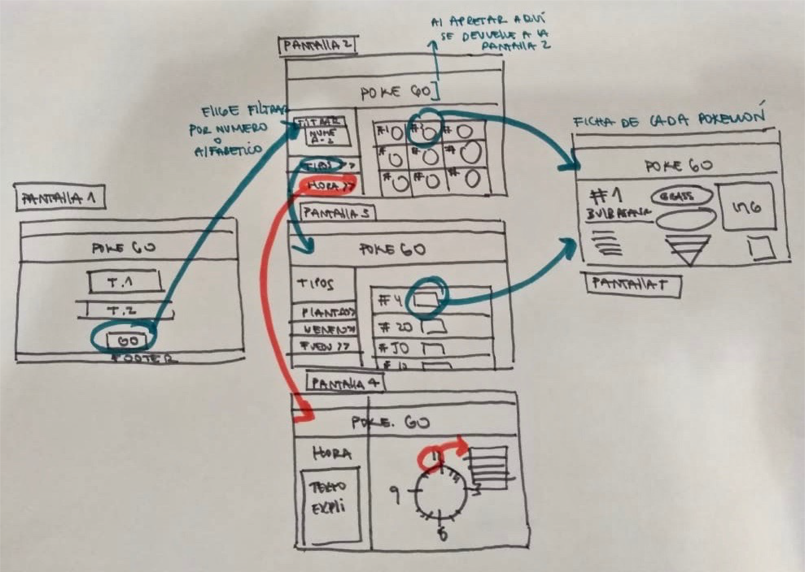
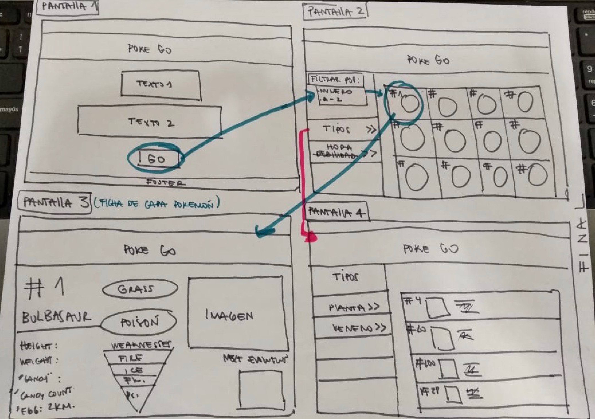
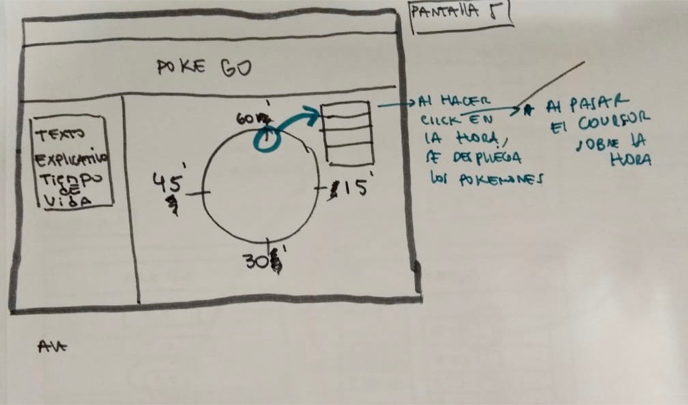
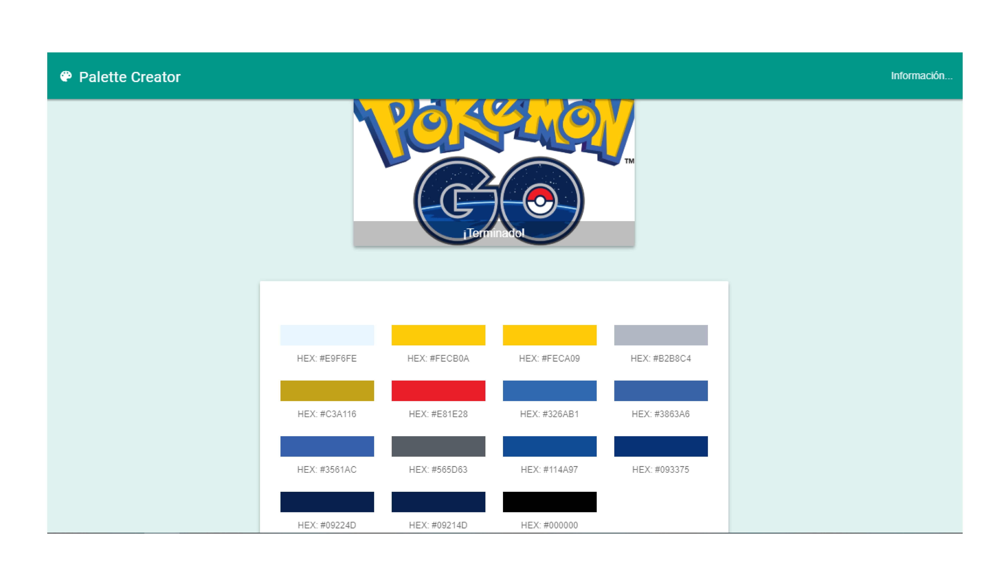
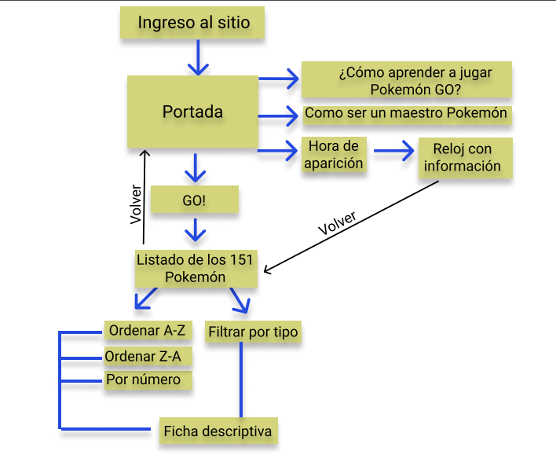

[VER DEMO](https://anagalvezsalas11.github.io/scl-2018-12-bc-core-data-lovers/)

# POKEGO

## **Introducción**

Pokego es una página web dirigida a jóvenes principiantes que están interesados en conocer los 151 pokemón de la región de Kanto, mediante nuestra página podrán acceder a una ficha informativa de cada uno de ellos (dónde se detalla sus debilidades, tipo, peso, etc.), obtener información adicional de como ser un maestro Pokemón y saber la cantidad de Pokemon que aparecen por hora. Los contenidos de nuestra web permitiría a los usuarios tener más conocimiento sobre Pokemón Go! y jugar con mayor información.

Como se ha señalado anteriormente esta página esta pensada para jóvenes y la edad promedio es entre 18 y 30 años, dado a que los estudios que se han realizado demuestran que ocupan el 46% del total de la población que juega PokemonGo!, (como se muestra en la siguiente imagen):

## **Ideación de Diseño**

Para definir el contenido y estructura de nuestra interfaz comenzamos investigando otras páginas web para saber de que manera nos podríamos diferenciar y además realizamos entrevistas a jugadores de Pokemón Go!.

Algunas páginas visitadas:

[Página 1](https://db.pokemongohub.net/pokemon-list/type-ground)

[Página 2](https://es.wikihow.com/jugar-Pok%C3%A9mon-GO)

[Página 3](http://es.pokemon.wikia.com/wiki/Tipo_planta)

### **Entrevista**  

Entrevistamos a 5 personas, las respuestas frente a las preguntas son las siguientes:

1- ¿Qué son los team? (para saber como clasificamos los pokemones)

Son tres grandes equipos, rojo, amarillo y azul, cuando se comienza a jugar hay que elegir un color, sólo una vez se puede cambiar. Los gimnasios están determinados por color y puede cambiar a través de una batalla y queda para el color ganador.

2- ¿Qué aspectos relevantes debemos considerar en nuestra web para principiantes?

El Pokemón que es más fuerte y más débil, en cuanto combate. PC (poder de combate), clasificar por tipo (fuego, agua, etc.)

3- ¿Juegan sólo para coleccionar Pokemón o para batallar?

Para batallar y para coleccionar.

4- ¿Qué fue lo primero que investigaron para poder combatir o coleccionar?

Aprendieron por la serie y con videojuegos que tenían de antes, buscaron por foro, por amigos y google. 

### **Historia de usuario**

Con la información obtenida mendiante las entrevistas e investigación por internet podemos diseñar la historia de usuario:

Historia Nº 1

Como: Jugador principiante de pokemon go.

Quiero: Saber los tipos de pokemon que hay.

Para: Tener una visión más amplia de los pokemon que hay por grupo.

Criterios de aceptación de Historia Nº 1:

Dada: La información de los grupos que hay.

Cuando: El usuario hace click en "Tipos de Pokemon".

Entonces: Apareceran los grupos de Pokemón que hay, en cada uno de ellos el listado de los Pokemón que lo integran.

Historia Nº 2

Como: Jugador principiante de Pokemón Go.

Quiero: Saber que Pokemón son más probables de encontrar en una hora determinada.

Para: Ver cuales puedo evolucionar primero.

Criterios de aceptación, historia 2

Dada: La opcion que aparece en la pagina web.

Cuando: El jugador hace click en "Hora".

Entonces: Se muestra el listado de Pokemón que aparece en una hora determinada

Historia Nº 3

Como: Jugador principiante de Pokemón Go.

Quiero: Conocer todos los Pokemón de la Región de Kanto.

Para: Aprender a jugar y ser un maestro pokemón.

Criterios aceptación Nº 3

Dada: A un listado de Pokemón que se despliega en la página, el usuario hace click en una imagen.

Cuando: Se carga la página con ese Pokemón.

Entonces: Aparecerá el listado de características del pokemon.

### **Definición de Terminado**

Historia Nº 1

* Abrir el select "Tipos de Pokemon" haciendo click.
* Se despliega las categoría que hay de Pokemón.
* El usuario debe seleccionar la categoria que quiere al hacer click.
* Al hacer click va a aparecer los Pokemón del tipo seleccionado.

Historia Nº 2

* En la parte superior de la página habrá un boton con el nombre de "hora de aparición"
* Al hacer click en el boton aparece una nueva pagina.
* En la pagina estará la imagen de un reloj donde el usuario posiciona el cursor sobre una hora determinada y se mostrará el listado de pokemon que aparen en esa hora.

Historia Nº 3

* Al ingresar a la página principal el usuario hará click en GO! para conocer a los pokemones.
* Aparece el listado de imagenes de todos los pokemones ordenados por numero
* En la parte superior de la pagina habrá un "select" donde aparece la opción de ordenar el listado de pokemones por alfabeto, que puede ser desde la A/Z o Z/A y por numero.
* El usuario al hacer click en una imagen tendrá la posibilidad de conocer la ficha técnica/descriptiva del pokemon.

### **Prototipo de baja de nuestra pagina PokeGo!**

Diseñamos protptipo de pagina que consta de tres pantalla, la primera es de bienvenida y con un boton "GO" el usuario podrá interactuar con la información que desea obtener. La segunda pantalla es donde se despliega todos los pokemones donde el usuario puede ordenar los 151 pokemones por orden alfabetico ascendente y descendente y por numero, tambien mostraremos la opcion de que pueda tener más información sobre como ser un maestro pokemon, guia de como jugar PokemonGo! y saber la cantidad de pokemones que aparecen por hora durante el día. Éste último es la tercera pantalla donde lo vamos a interactuar con un reloj.

En esta imagen se muestra el protitpo de flujo de nuestra pagina

 

Aquí detallamos como se va a interactuar la información en la pantalla dos:

En esta última imagen es como tenemos pensado mostrar nuestro calculo de data.

### **Prototipo de alta de nuestra pagina Pokego!**

Luego de testar y analizar nuestro prototipo de baja, diseñamos nuestro prototipo de alta en Figma y lo exportamos a Zeplin.

[Ver prototipo en alta en Figma](https://www.figma.com/file/NZ8W3KBrc3oz3UcEUSb8PIuo/PokeGO?node-id=0%3A1)

[Exportación del proyecto de Figma a Zeplin](https://zpl.io/29oOzrw)

El prototipo en alta fue testeado y grabado:

[Video uno de testeabilidad](https://github.com/AnaGalvezSalas11/scl-2018-12-bc-core-data-lovers/blob/master/src/Videos%2C%20testeo%20de%20pagina%20en%20alta/Diego.mp4)

[Video dos de testeabilidad](https://github.com/AnaGalvezSalas11/scl-2018-12-bc-core-data-lovers/blob/master/src/Videos%2C%20testeo%20de%20pagina%20en%20alta/Nicolas.mp4)

Las observaciones que tuvimos de los usuarios frente a nuestro prototipo de pagina web fue:

* Que en el reloj donde damos a conocer el listado de pokemon, debieramos dar la opción de conocer la ficha descroptiva de cada uno de ellos al hacer click (como en la pantalla 2)

* Que en la ficha descriptiva de cada pokemon indicar de que manera es la evolución por pokemon.

* Les gustó que las debilidades aparezcan en colores (más visual) que solo nombrarlos.

 
Paleta de colores usada en la interfaz:

### **Flujo interactivo de PokeGO!**

### **Planificación en Trello**

[Trello PokeGO!](https://trello.com/b/J9VDuFEc/pokemon-go)

